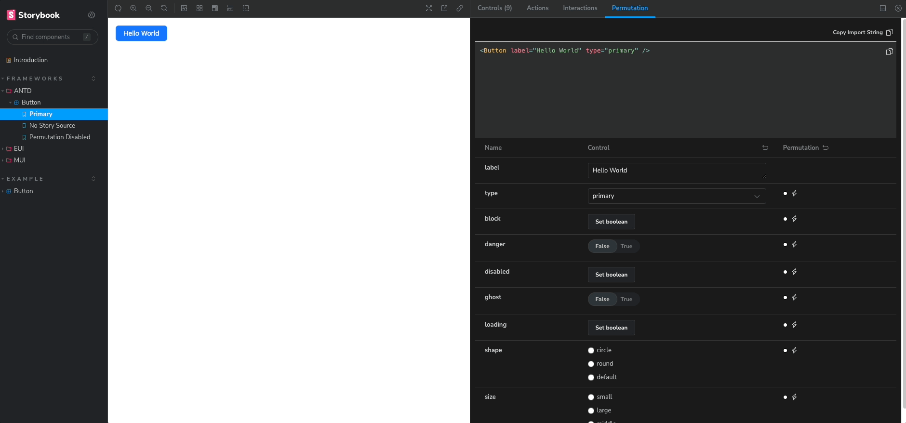

# sb-addon-permutation-table

[]()

- **Note: English ver Readme is workon progress**
- **Typescript only Project. we don't have a plan support for Javascript**



이 프로젝트는 Storybook에 추가 기능을 제공하기 위한 애드온입니다.
별도의 패널 창을 통하여 컴포넌트의 다양한 모습을 테이블로서 확인할 수 있습니다.

Datadog의 디자인 시스템인 [DRUID](https://druids.datadoghq.com/)에 크게 영감을 받은 프로젝트로, DRUID에서 보여주는 Component Permutation 기능을 Storybook에서도 사용하고자 제작하게 되었습니다.

## Table of contents

- [Feature](#feature)
- [Installation](#installation)
- [Why should I use it?](#why-should-i-use-it)
- [Usage](#usage)
- [Third-party libs](#third-party-libs)
- [Demos](#demos)
- [License](#license)

### Feature

- Argument Control: 컴포넌트의 속성을 직접 조작할 수 있습니다. 상황에 맞는 컴포넌트의 모습을 확인할 수 있습니다.
- Permutation : 여러 속성 조합에 대한 모습을 테이블로 제공합니다. 조합의 결과를 한 눈에 비교하고 분석할 수 있습니다

### Installation

`yarn add sb-addon-permutation-table`

**Recommendation : SB 7.x >=**

### Why should I use it?

sb-addon-permutation를 사용하면 복잡하고 많은 속성을 가진 컴포넌트의 모습을 한 눈에 확인할 수 있습니다. 개발자는 애드온이 제공하는 쇼케이스를 통하여 효율적으로 컴포넌트를 디버깅하고, 테스트 할 수 있게 됩니다.

### Usage

`.stories/main.ts`에 아래와 같이 애드온을 추가합니다.

```
import type { StorybookConfig } from "@storybook/react-vite";
const config: StorybookConfig = {
  stories: ["../src/**/*.mdx", "../src/**/*.stories.@(js|jsx|ts|tsx)"],
  addons: ["sb-addon-permutation-table"],
  framework: {
    name: "@storybook/react-vite",
    options: {}
  },
  docs: {
    autodocs: "tag"
  }
};

export default config;

```

이후, 애드온의 기능을 사용하려면 각 스토리에 인자를 전달해줘야합니다.
편의를 위해 `PermutationMeta` 타입을 스토리에 적용할 수 있습니다.

```
// stories/Component.stories.(ts|tsx)

import React from 'react';
import { PermutationMeta } from 'sb-addon-permutation-table';
import YourComponent from 'YourComponent';

const meta:PermutationMeta<typeof YourComponent> ={
  //...
  parameters :{
    storySource : {
      source : <YourComponent/>, // type what your component looks like
      importPath: "import YourComponent from 'yourpackage" // import path of packaged component
    },
    permutation :{
      scope: {
        YourComponent, // add component here
      }
    }
  }
}

```

## Third-party libs

[react-runner](https://github.com/nihgwu/react-runner) : React 코드를 실행시키고, Editor View를 위해 사용됨

### Demos

[Demo Page](https://daimresearch.github.io/sb-addon-permutation-table/?path=/docs/introduction--docs)

### License

MIT

## Sponsors

<a href="http://www.daimresearch.com/" target="_blank"></a>
