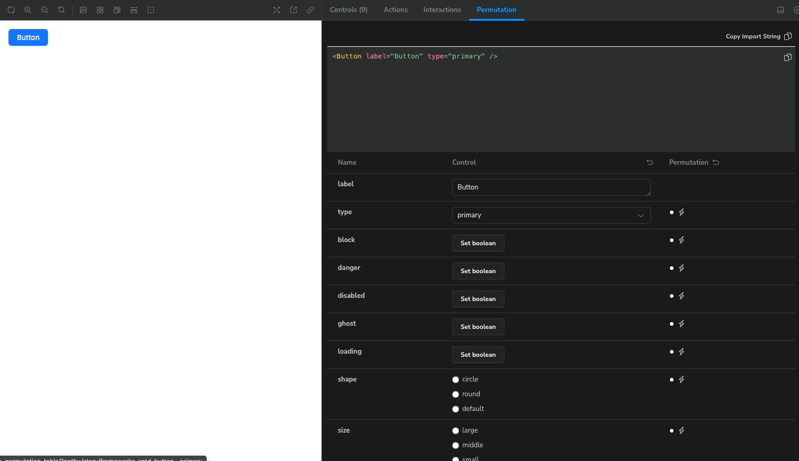

<div align="center">
  
  <h1>sb-addon-permutation-table</h1>
  <span></span>
  <span></span>
  <span></span>
  <div>
  <strong><a href="./README.ko.md" target="_blank">Korean</a></strong> |
  <strong><a href="https://daimresearch.github.io/sb-addon-permutation-table/?path=/docs/introduction--docs" target="_blank">Demos</a></strong>
  </div>
</div>
<hr/>

- **Disclaimer: This is only guaranteed to work with React-based projects. Other frameworks may introduce unintended errors.**
- **Typescript only Project. We don't have a plan to support Javascript**



This project is an addon that provides additional functionality to Storybook. In a separate panel, you can see the various aspects of the component as a table.

This project was highly inspired by Datadog's design system, [DRUIDS](https://druids.datadoghq.com/), and we wanted to use the Component Permutation feature from DRUIDS in Storybook.

---

🆘 **Help us make `sb-addon-permutation-table` even more awesome!** 🆘

We've got a small favor to ask. After the v1.0.0 release, we tried making `sb-addon-permutation-table` work with Vue and Svelte too, but we hit a tiny roadblock. Our Addon is head over heels for a React hook, and it just can't get enough! As of now, `sb-addon-permutation-table` is still deeply in love with React and hasn't quite opened its heart to other frameworks.

If we can get rid of React hooks in Panel and Preview, this marvalous addon will be shine regardless of what framework you are working on.

Can you lend a helping hand? 🥺

```
-The Mighty Quest-

1. Take a peek at our GitHub - the code is all there, waiting for your brilliance.
2. Got any bright ideas? Quirky solutions? Magical spells 🧙‍♂️? Share them with us, and we'll be forever grateful!
3. Spread the word! Let your fellow developers know about "sb-addon-permutation-table"'s quest for multi-framework love.
4. Together, we can make "sb-addon-permutation-table" truly awesome for all frameworks out there! 🌟
```

---

## Table of contents

- [Feature](#feature)
- [Installation](#installation)
  - [Requirements](#requirements)
- [Why should I use it?](#why-should-i-use-it)
- [Usage](#usage)
  - [Advance](#advance)
- [Demos](#demos)
- [License](#license)

### Feature

- `Argument Control` : Manipulate the properties of your component directly. You can see what your component looks like in context.

- `Permutation` : Provide a table of different views with combinations of properties. Compare and analyze the results of combinations at a glance.

### Installation

`yarn add sb-addon-permutation-table`

#### Requirements

- `Storybook >= 7.x`
- `node >= 16.x`

### Why should I use it?

`sb-addon-permutation` provides a quick glance of complex, multi-property component views. Developers will be able to debug and test components efficiently through the showcase provided.

### Usage

Add addon code in `.stories/main.ts` like below.

```typescript
import type { StorybookConfig } from "@storybook/react-vite";
const config: StorybookConfig = {
  stories: ["../src/**/*.mdx", "../src/**/*.stories.@(js|jsx|ts|tsx)"],
  addons: ["sb-addon-permutation-table"],
  framework: {
    name: "@storybook/react-vite",
    options: {},
  },
  docs: {
    autodocs: "tag",
  },
};

export default config;
```

Unlike version 0.x, starting with version 1, no configuration is required to use the add-on.
The add-on automatically pulls in the elements from each Story, but you can be more granular by passing in a parameter. The values accepted as parameter are shown below. The values used as parameter are not related to Preview, but are specified for use in the Panel.

| name          | description                                                                                                  | type       | default Value  |
| ------------- | ------------------------------------------------------------------------------------------------------------ | ---------- | -------------- |
| componentName | The name of the component that appears in the Panel                                                          | `string?`  | `Story의 이름` |
| importPath    | The path of the component that is copied when the `Copy import path` button is clicked.                      | `string?`  | `""`           |
| children      | children in the Story Component                                                                              | `string?`  | `{{children}}` |
| deactivate    | Property Name for which you do not want to use the Permutation feature                                       | `string[]` | `[]`           |
| autoload      | When the Story is loaded, you can create a property that will be automatically activated without any clicks. | `all       | string[]`      |

**More about the parameter children**

The children parameter refers to the shape of the children's code that will be displayed in the CodeEditor area of the Panel when children is passed as an argument to the Story. Passing children as an argument will display correctly in Preview, but in the Panel, children will be displayed as `{{children}}` unless you pass a separate parameter. Use this parameter when you want to show the geometry of children in the Panel.

[See also: How to use children as an arg in Storybook](https://storybook.js.org/docs/react/writing-stories/stories-for-multiple-components#using-children-as-an-ar)

Usage

```typescript
// stories/Component.stories.(ts|tsx)

import React from "react";
import { PermutationMeta } from "sb-addon-permutation-table";
import YourComponent from "YourComponent";

const meta: PermutationMeta<typeof YourComponent> = {
  //...
  parameters: {
    permutation: {
      componentName: "Takahashi", // "Takahashi" in the panel, regardless of the name of the component.
      importPath: "@yourLib/yourComponent", // the value copied when clicked "Copy import" button
      children: "<div>Chef of the diamond city</div>", // a value passed to children
      deactivate: ["foo", "bar"], // deactviate property foo,bar
      autoload: "all", // activate all property except deactivated
    },
  },
};
```

The addon will automatically use your component's type and make it available in the Permutation Panel.

If you have a property that you don't want to use Permutation for, you can pass the name of that property to deactivate.

````typescript
const meta: PermutationMeta<typeof YourComponent> = {
  //...
  parameters: {
    storySource: {
      source: <YourComponent />, // type what your component looks like
      importPath: "import YourComponent from 'yourpackage", // import path of packaged component
    },
    permutation: {
      scope: {
        YourComponent, // add component here
      },
      deactivate: ["foo", "bar"], // now property "foo" and "bar" disabled.
    },
  },
};

You can also apply them individually on a story by story basis.

```typescript
export const Primary: Story = {
  args: {
    primary: true,
    label:'Hello World'
  },
};

export const PermutationDisabled: Story = {
  args:{
    label:'Hello World'
  }
  parameters: {
    permutation: {
      deactivate: ["primary", "size"],
    },
  },
};
````

### Advance

#### Apply different settings to individual stories

permuation parameters can applied separately. If you want to use permutation table on not a entire story but one story, you can set config like below

```tsx

const meta:PermutationMeta<type of Foo>= {
  title:'Example/Foo',
  component: Foo,
  parameters: {
    permutation: {
    // This importPath parameter can also be applied to individual stories
    // but we don't recommend this causeof inconvenien다
    permutation :{
      importPath : "import Foo from somewhere"
    }
    }
  }
}

export default meta
export type Story = StoryObj<typeof Foo>


// case that want to see Primary story without Permutation but not to Secondary story

export const Primary:Story = () => {
  return(
    <Wrapper>
      <Foo/>
    </Wrapper>
  )
}

export const Secondary: Story = {
  parameters:{
    permutation:{
      deactivate: ['bar']
    }
  }
}


```

#### Activate autoload

when autoload is enabled, permutation table is automatically be activated when the story is loaded.

```tsx
export const Primary: Story = {
  args: {
    primary: true,
  },
  parameters: {
    permutation: {
      // Now all element that can be permuted are now active when story is loaded
      autoload: "all",
    },
  },
};
```

You can also enable only some attribute

```tsx
export const Primary: Story = {
  args: {
    primary: true,
  },
  parameters: {
    permuations: {
      // only 'foo' and 'bar' attribute will be activated
      autoload: ["foo", "bar"],
    },
  },
};
```

If both autoload and deactivate are allowed, deactivate takes precedence.

```tsx
export const Primary: Story = {
  args: {
    primary: true,
  },
  parameters: {
    permuations: {
      // only 'bar' attribute is permuted
      autoload: ["foo", "bar"],
      deactivate: ["foo"],
    },
  },
};
```

### Demos

[Demo Page](https://daimresearch.github.io/sb-addon-permutation-table/?path=/docs/introduction--docs)

### License

MIT

## Sponsors

<a href="http://www.daimresearch.com/" target="_blank"></a>
